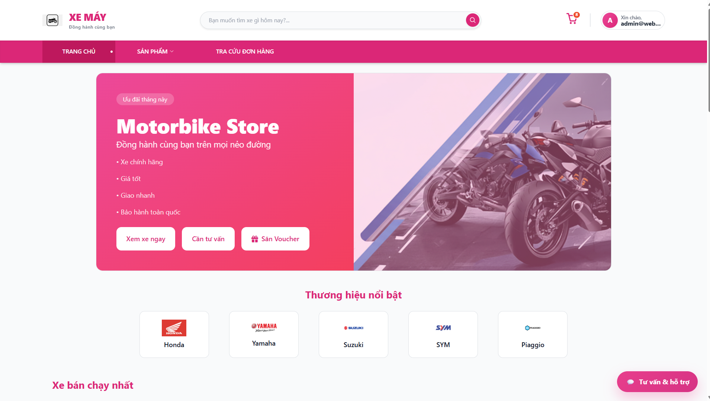
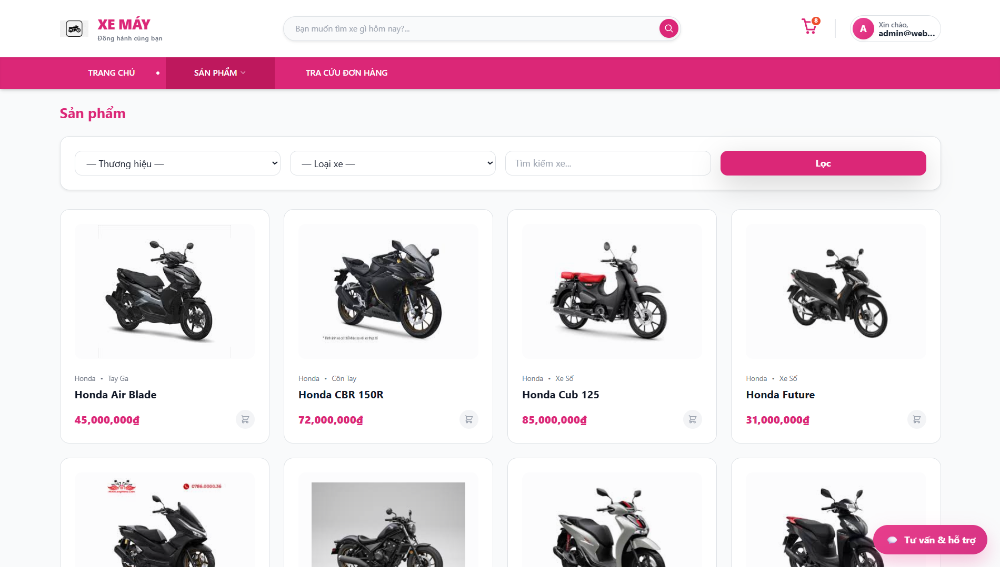
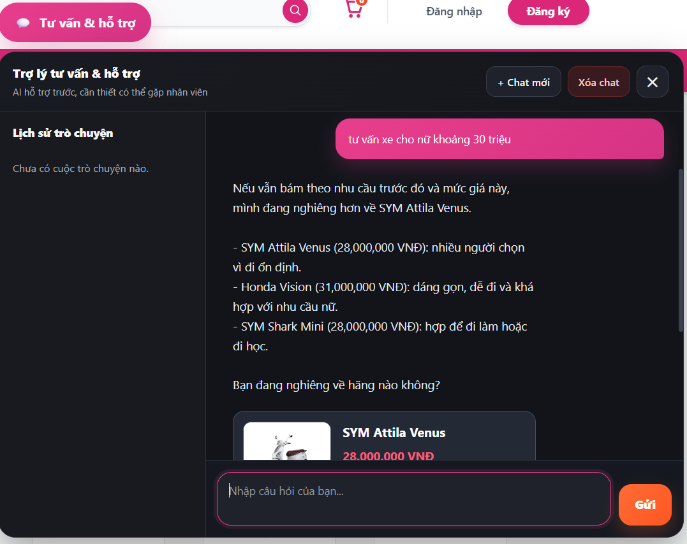
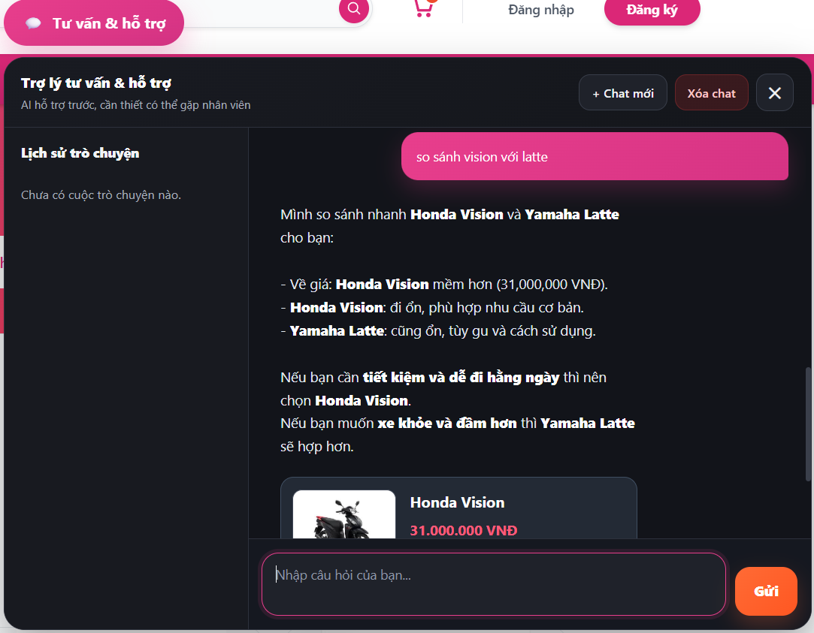
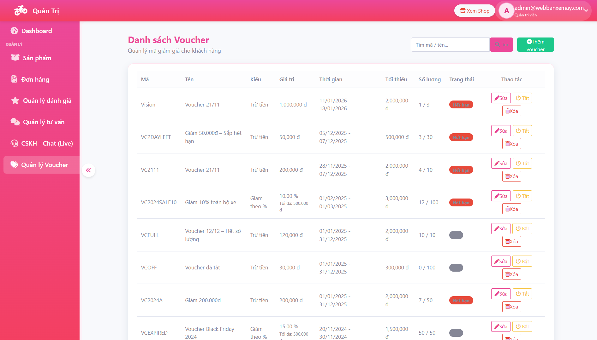
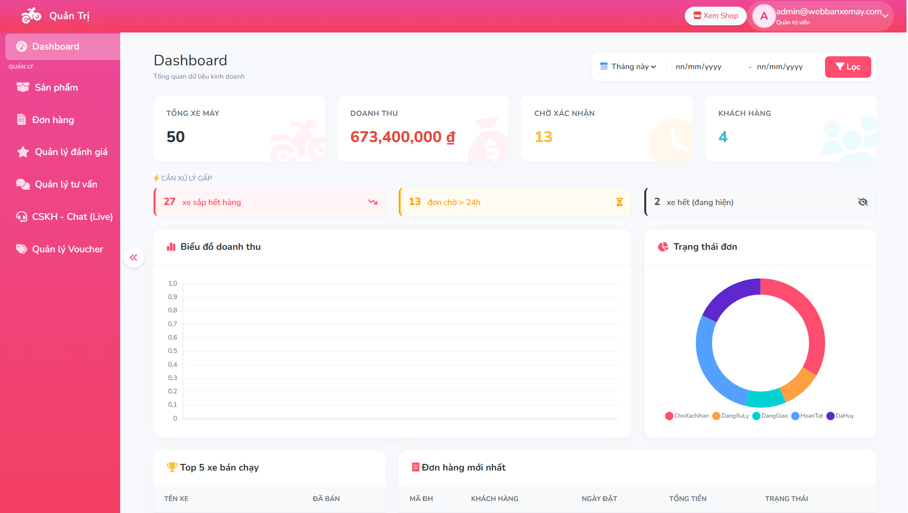

# 🏍️ Website Bán Xe Máy Tích Hợp AI Chatbot

Đây là đồ án tốt nghiệp của nhóm mình, xây dựng một website bán xe máy bằng ASP.NET Core MVC và tích hợp AI Chatbot để hỗ trợ khách hàng trong quá trình tìm hiểu sản phẩm.

Khác với chatbot hỏi đáp thông thường, chatbot trong dự án có khả năng:

* Tư vấn sản phẩm theo nhu cầu người dùng
* So sánh các mẫu xe
* Kiểm tra tồn kho
* Tra cứu đơn hàng
* Ghi nhớ nội dung cuộc trò chuyện trước đó

Dự án được thực hiện bởi nhóm 2 thành viên. Mình phụ trách phần chatbot và website, thành viên còn lại phụ trách Telegram Bot.

---

## Công nghệ sử dụng

### Backend

* ASP.NET Core MVC
* Entity Framework Core
* SQL Server
* C#

### AI Chatbot

* OpenAI API
* ChromaDB
* Retrieval-Augmented Generation (RAG)
* Conversation Memory

### Frontend

* Razor View
* Bootstrap
* JavaScript
* AJAX

---

## Những gì mình thực hiện

Trong dự án này mình phụ trách:

* Thiết kế luồng xử lý chatbot
* Xây dựng cơ chế nhận diện ý định người dùng (Intent Routing)
* Xây dựng Conversation Memory
* Tích hợp OpenAI API
* Xây dựng chức năng tư vấn sản phẩm
* Xây dựng chức năng so sánh sản phẩm
* Xây dựng chức năng kiểm tra tồn kho
* Xây dựng chức năng tra cứu đơn hàng
* Tích hợp chatbot vào website
* Phát triển các chức năng web chính

---

## Một số bài toán đã giải quyết

### Ghi nhớ ngữ cảnh hội thoại

Ví dụ:

> Tư vấn xe khoảng 30 triệu

Chatbot đề xuất:

* Honda Vision
* Yamaha Latte

Sau đó người dùng chỉ cần nhập:

> So sánh xe đầu tiên với xe thứ hai

Chatbot vẫn hiểu được sản phẩm nào đang được nhắc tới.

---

### Giảm thông tin trả lời sai

Những thông tin như:

* Tồn kho
* Giá sản phẩm
* Trạng thái đơn hàng

được lấy trực tiếp từ cơ sở dữ liệu thay vì để AI tự tạo ra câu trả lời.

---

## Hình ảnh hệ thống

### Trang chủ



### Danh sách sản phẩm



### Chatbot tư vấn sản phẩm



### Chatbot so sánh sản phẩm



### Quản lý đơn hàng



### Dashboard quản trị



---

## Cấu trúc dự án

```text
WebBanXeMay
│
├── WebBanXeMay/
├── Chatbot.API/
├── Chatbot.API.Tests/
├── docs/
└── WebBanXeMay.sln
```

---

## Thành viên thực hiện

### Diễm Quỳnh

Phụ trách:

* AI Chatbot
* Website Development

### Thành viên còn lại

Phụ trách:

* Telegram Bot
