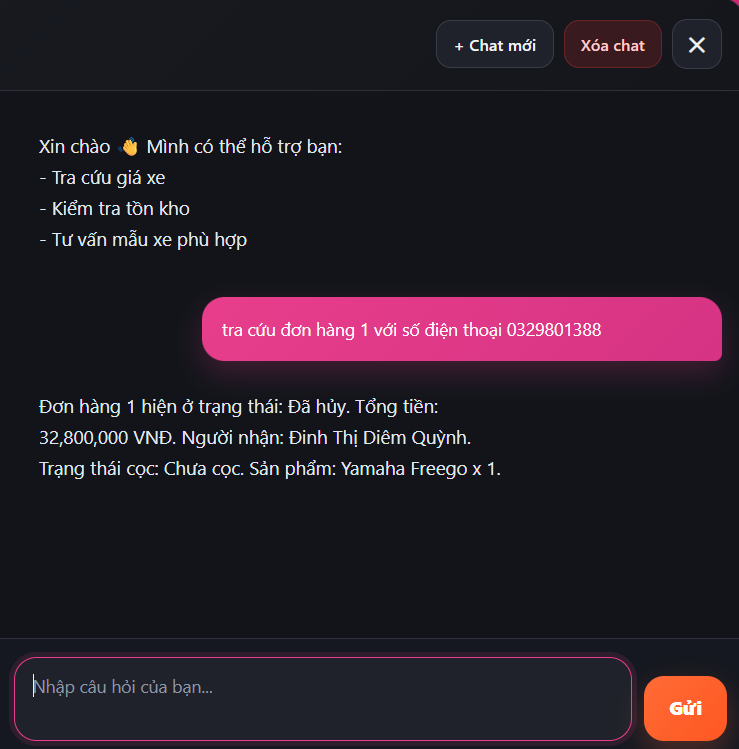

# 🏍️ Hệ Thống Thương Mại Điện Tử Xe Máy Tích Hợp AI Chatbot

Hệ thống thương mại điện tử bán xe máy được phát triển bằng ASP.NET Core MVC, tích hợp AI Chatbot hỗ trợ tư vấn khách hàng thông minh thông qua OpenAI, Retrieval-Augmented Generation (RAG) và Conversation Memory.

Dự án được thực hiện với mục tiêu xây dựng một nền tảng bán xe trực tuyến kết hợp trợ lý AI có khả năng hiểu ngữ cảnh, tư vấn sản phẩm, so sánh xe, kiểm tra tồn kho và tra cứu đơn hàng.

---

# 📌 Tổng Quan Dự Án

Hệ thống bao gồm hai thành phần chính:

## Website Thương Mại Điện Tử

Cho phép người dùng:

* Xem danh sách sản phẩm
* Tìm kiếm và lọc xe máy
* Xem thông tin chi tiết sản phẩm
* Thêm vào giỏ hàng
* Đặt hàng trực tuyến
* Theo dõi trạng thái đơn hàng

## AI Chatbot

Chatbot hỗ trợ:

* Tư vấn xe theo nhu cầu người dùng
* So sánh sản phẩm
* Kiểm tra tồn kho
* Tra cứu đơn hàng
* Hội thoại nhiều lượt (Multi-turn Conversation)
* Ghi nhớ ngữ cảnh hội thoại (Conversation Memory)
* Hỗ trợ Website và Telegram

---

# 🚀 Điểm Nổi Bật

## AI Chatbot

* Intent Routing Architecture
* Conversation Memory
* Multi-turn Context Handling
* Product Recommendation
* Product Comparison
* Inventory Lookup
* Order Lookup

## Retrieval-Augmented Generation (RAG)

* ChromaDB Vector Database
* Semantic Search
* Context Grounding
* Context Injection

## Business Integration

* Truy vấn dữ liệu sản phẩm theo thời gian thực
* Kiểm tra tồn kho từ cơ sở dữ liệu
* Tra cứu đơn hàng thực tế
* Tích hợp dữ liệu nghiệp vụ vào chatbot

## Multi-Channel Support

* Website Chat Widget
* Telegram Bot

---

# 🏗️ Kiến Trúc Hệ Thống

## Luồng Xử Lý Chatbot

```text
User
 ↓
Chat Controller
 ↓
Chat Orchestrator
 ↓
Intent Detection
 ↓
Decision Engine
 ├─ Business Rules
 ├─ Conversation Memory
 ├─ Tool Services
 └─ LLM Service
         ↓
        RAG
         ↓
      OpenAI
         ↓
Response Generation
         ↓
User
```

## Triết Lý Thiết Kế

Hệ thống sử dụng kiến trúc Hybrid AI:

### Rule-Based Layer

Xử lý:

* Kiểm tra tồn kho
* Tra cứu đơn hàng
* Truy vấn dữ liệu sản phẩm
* Các nghiệp vụ xác định

### AI Layer

Xử lý:

* Hiểu ý định người dùng
* Hội thoại tự nhiên
* Tư vấn sản phẩm
* So sánh sản phẩm

### RAG Layer

Xử lý:

* Semantic Search
* Context Grounding
* Knowledge Retrieval

Mục tiêu:

* Giảm Hallucination
* Tăng độ chính xác
* Đảm bảo dữ liệu nghiệp vụ đáng tin cậy

---

# 🧠 Các Bài Toán Kỹ Thuật Đã Giải Quyết

## 1. Ghi Nhớ Ngữ Cảnh Hội Thoại

Ví dụ:

```text
Tư vấn xe khoảng 30 triệu

→ Honda Vision
→ Yamaha Latte

So sánh xe đầu tiên với xe thứ hai
```

Chatbot vẫn hiểu được người dùng đang đề cập tới Honda Vision và Yamaha Latte mà không cần nhập lại tên sản phẩm.

Giải pháp:

* Conversation Memory
* Context Tracking
* Context Injection

---

## 2. Giảm Hallucination

Vấn đề:

Mô hình AI có thể tạo ra thông tin không tồn tại trong hệ thống.

Giải pháp:

* Tách Business Rules khỏi AI
* Dữ liệu sản phẩm lấy trực tiếp từ Database
* Tích hợp RAG để grounding dữ liệu

---

## 3. Tư Vấn Sản Phẩm Theo Nhu Cầu

Ví dụ:

```text
Tư vấn xe cho nữ khoảng 30 triệu
```

Chatbot phân tích:

* Đối tượng sử dụng
* Khoảng giá
* Nhu cầu

Sau đó đề xuất các sản phẩm phù hợp từ cơ sở dữ liệu.

---

## 4. So Sánh Sản Phẩm Theo Ngữ Cảnh

Ví dụ:

```text
So sánh Vision và Latte

Hoặc

So sánh xe đầu tiên với xe thứ hai
```

Chatbot có khả năng xác định chính xác các sản phẩm cần so sánh dựa trên ngữ cảnh trước đó.

---

# 🗄️ Cơ Sở Dữ Liệu

Các thực thể chính:

* Product
* Category
* Brand
* Customer
* Order
* OrderDetail
* Review
* Voucher
* Conversation
* ConversationMessage

Dữ liệu được sử dụng đồng thời cho:

* Website bán hàng
* Chatbot AI
* Tra cứu đơn hàng
* Kiểm tra tồn kho

---

# 💻 Công Nghệ Sử Dụng

## Backend

* ASP.NET Core MVC
* C#
* Entity Framework Core
* SQL Server

## AI Components

* OpenAI API
* ChromaDB
* Retrieval-Augmented Generation (RAG)
* Conversation Memory
* Intent Routing
* Chat Orchestrator

## Frontend

* Razor View
* Bootstrap
* JavaScript
* AJAX

## Integration

* Telegram Bot API

---

# 👨‍💻 Vai Trò Và Đóng Góp

Dự án được thực hiện bởi nhóm 2 thành viên.

## Vai Trò Của Tôi

### AI Chatbot Developer & Web Developer

Các phần trực tiếp phụ trách:

* Thiết kế kiến trúc chatbot
* Xây dựng Intent Routing Engine
* Xây dựng Conversation Memory
* Phát triển Product Recommendation
* Phát triển Product Comparison
* Phát triển Inventory Lookup
* Phát triển Order Lookup
* Tích hợp OpenAI API
* Tích hợp ChromaDB và RAG
* Xây dựng Chat Orchestrator
* Thiết kế luồng hội thoại đa lượt
* Tích hợp chatbot vào website ASP.NET Core MVC
* Phát triển giao diện web và các chức năng thương mại điện tử

## Vai Trò Thành Viên Còn Lại

### Telegram Bot Developer

Các phần phụ trách:

* Tích hợp Telegram Bot API
* Xây dựng luồng giao tiếp Telegram
* Kết nối Telegram với hệ thống chatbot
* Kiểm thử và triển khai Telegram Bot

---

# 📸 Hình Ảnh Hệ Thống

## Trang Chủ


---

## Danh Sách Sản Phẩm


---

## Chatbot Tư Vấn Sản Phẩm


---

## Chatbot So Sánh Sản Phẩm


---

## Chatbot Tra Cứu Đơn Hàng



---

## Quản Lý Đơn Hàng


---

## Dashboard Quản Trị


---

# 📂 Cấu Trúc Dự Án

```text
WebBanXeMay
│
├── WebBanXeMay/              MVC Application
├── Chatbot.API/              AI Chatbot Service
├── Chatbot.API.Tests/        Unit Tests
├── docs/                     README Images
│
├── README.md
└── WebBanXeMay.sln
```

---

# 🎯 Kết Quả Đạt Được

* Hoàn thành hệ thống thương mại điện tử xe máy
* Xây dựng AI Chatbot tích hợp OpenAI
* Triển khai Conversation Memory
* Triển khai RAG với ChromaDB
* Hỗ trợ hội thoại nhiều lượt
* Hỗ trợ tư vấn sản phẩm theo nhu cầu
* Hỗ trợ so sánh sản phẩm theo ngữ cảnh
* Hỗ trợ tra cứu đơn hàng và tồn kho
* Tích hợp Telegram Bot

---

# 👥 Nhóm Phát Triển

Dự án được thực hiện bởi nhóm 2 sinh viên Công nghệ Thông tin.

### Diễm Quỳnh

Vai trò:

* AI Chatbot Developer
* Web Developer

### Thành viên còn lại

Vai trò:

* Telegram Bot Developer
