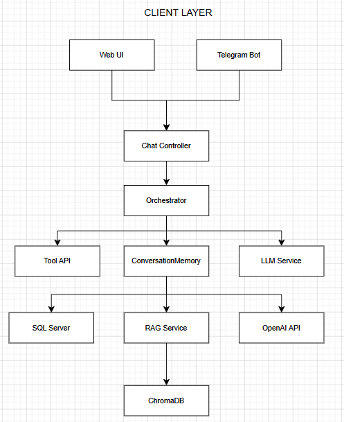
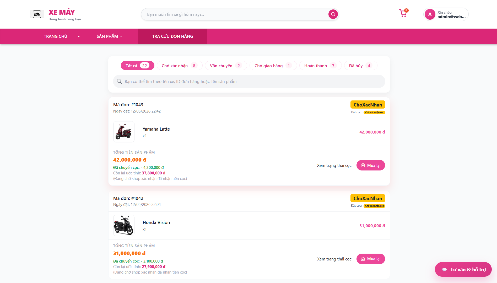

# AI-Powered Motorcycle E-Commerce Platform

An ASP.NET Core MVC motorcycle e-commerce platform integrated with an AI chatbot, Retrieval-Augmented Generation (RAG), and Telegram Bot.

## Key Contributions

* Designed and implemented a chatbot orchestration architecture.
* Built intent routing and conversation memory modules.
* Integrated OpenAI and RAG for contextual responses.
* Implemented real-time order lookup and inventory retrieval.
* Developed Telegram Bot integration.
* Built a complete motorcycle e-commerce and administration system.

---

## Features

### Customer Features

* Browse motorcycle catalog
* Search and filter products
* View product details
* Track orders
* Use AI chatbot for support

### AI Chatbot

The chatbot supports:

* Product recommendation
* Product comparison
* Inventory lookup
* Order lookup
* Context-aware conversations
* Multi-turn interactions

Example queries:

* "Tư vấn xe cho nữ khoảng 30 triệu"
* "So sánh Vision với Latte"
* "Vision còn hàng không?"
* "Tra cứu đơn hàng 1041"

### Admin Features

* Dashboard & analytics
* Product management
* Order management
* Voucher management
* Review moderation
* Customer consultation management

---

## Tech Stack

### Backend

* ASP.NET Core MVC
* C#
* Entity Framework Core
* SQL Server

### AI Components

* OpenAI API
* Retrieval-Augmented Generation (RAG)
* ChromaDB
* Conversation Memory
* Intent Routing
* Chat Orchestrator

### Frontend

* Razor Views
* Bootstrap
* JavaScript
* AJAX

### Integration

* Telegram Bot API

---

## System Architecture



---

## Screenshots

### Home Page


### Product Catalog


### Order Tracking



### Admin Dashboard


### Order Management


---

## AI Chatbot

### Product Recommendation


### Product Comparison


### Order Lookup


---

## Project Structure

```text
WebBanXeMay
│
├── WebBanXeMay/          # ASP.NET Core MVC Application
├── Chatbot.API/          # Chatbot Service
├── Chatbot.API.Tests/    # Unit Tests
├── Chatbot-dev/          # Development Utilities
├── docs/                 # Screenshots & Architecture
│
└── README.md
```

---

## Highlights

* Hybrid chatbot architecture combining business rules and LLM capabilities.
* RAG-based knowledge retrieval using ChromaDB.
* Real-time business data retrieval from SQL Server.
* Multi-channel deployment (Website + Telegram).
* Context-aware conversation handling with memory support.

---

## Author

Graduation Thesis Project

AI-Powered Motorcycle E-Commerce Platform with Intelligent Conversational Assistant
